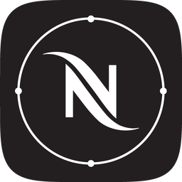

<p align="center">
  
</p>

<h1 align="center">Nespresso Smart for Home Assistant</h1>

<p align="center">
  <a href="https://my.home-assistant.io/redirect/hacs_repository/?owner=FezVrasta&amp;repository=ha-nespresso-smart&amp;category=integration"></a>
</p>

<p align="center">
  
  
  
</p>

Bring your Bluetooth-connected Nespresso **Vertuo** machine into Home Assistant.
Water tank, capsule container, descaling reminders and live brewing state, all
locally over Bluetooth. No cloud account polling, no bridge.

Works with **Vertuo Pop, Pop+, Next, Lattissima and Creatista**.

## What you get

| Entity | Reads |
|---|---|
| **State** | Ready, Brewing, Heating up, Power save, Descaling, and 23 more |
| **Water tank** | OK / Empty |
| **Capsule container** | OK / Full |
| **Descaling** | Not needed / Needed |
| **Cleaning** | Not needed / Needed |
| **Error** | None / Present |
| **Brewing unit** | Closed / Open |
| **Brewing** | Running while a cup is being made |
| **Water hardness** | Read *and* set it (0 to 4) |

Plus serial number and firmware versions as diagnostics.

State arrives by push, so **Brewing** flips within a second of you pulling the
lever. That's fast enough to trigger "your coffee is ready" notifications.

> **It can't start a coffee.** Vertuo machines read a barcode on the capsule to
> pick their programme and need the lever cycled by hand, so there's no remote
> brew. Not here, and not in Nespresso's own app either. This integration is
> about knowing what your machine is doing.
>
> Got an *Original* line machine (Expert, Prodigio)? Those *can* brew remotely.
> Use [bulldog5046/ha_nespresso_integration](https://github.com/bulldog5046/ha_nespresso_integration).

## Before you start

- Your machine must be in Bluetooth range of Home Assistant. A Vertuo's radio is
  weak, so if your HA box isn't in the kitchen, put an
  [ESPHome Bluetooth proxy](https://esphome.io/projects/?type=bluetooth) nearby.
  That's the reliable setup.
- Home Assistant 2024.12 or newer.

## Install

**HACS, one click.** Click the button, then *Download*, then restart Home
Assistant.

[](https://my.home-assistant.io/redirect/hacs_repository/?owner=FezVrasta&repository=ha-nespresso-smart&category=integration)

**HACS, manually.** HACS → ⋮ → *Custom repositories* → add
`https://github.com/FezVrasta/ha-nespresso-smart` as type *Integration*, then
install "Nespresso Smart" and restart.

**No HACS.** Copy `custom_components/nespresso_smart/` into your
`config/custom_components/` folder and restart.

## Set it up

Your machine is locked to a single **pairing key**. If you've ever used the
Nespresso phone app with it, that key is saved in your Nespresso account. Grab it
from there and both the app and Home Assistant keep working.

### 1. Get your pairing key

Log in at **[nespresso.com](https://www.nespresso.com/)** in your normal browser.
Then open the developer console on that page (`⌥⌘J` on Mac, `Ctrl+Shift+J` on
Windows/Linux) and paste this in:

```js
const acct = await (await fetch('/ecapi/identityprovider/v1/web-accounts/me',
    {credentials:'include'})).json();
const market = acct.market;
const cust = await (await fetch(`/ecapi/customers/v7/${market}/b2c/me`,
    {credentials:'include'})).json();
const machines = await (await fetch(
    `/ecapi/machines/v1/${market}/b2c/${cust.memberNumber}`,
    {credentials:'include'})).json();
console.table(machines.map(m => ({
    serial: m.serialNumber, mac: m.macAddress, pairingKey: m.pairingKey })));
```

You'll get a table of your machines. Copy the `pairingKey`, which is 32
characters, something like `A1B2C3D4E5F60718293A4B5C6D7E8F90`.

Do this in a real browser, not `curl`. Nespresso's API turns away scripted
clients, but your logged-in browser sails through.

### 2. Add the integration

Home Assistant usually spots the machine on its own, so look for a **Nespresso
Smart** discovery card on the Devices & Services page. If it doesn't appear, go
to **Settings → Devices & Services → Add Integration** and search for it.

Pick your machine, paste the pairing key, submit. Done.

### Never used the phone app?

Then there's no key to recover. Leave the pairing key box **empty** and Home
Assistant will create one and claim the machine.

If the machine *is* paired to the app but you can't get into the account, you can
factory-reset the machine (see its manual) and then use the empty-box route. Be
aware that removes it from the phone app.

## Automation ideas

```yaml
automation:
  - alias: "Coffee is ready"
    triggers:
      - trigger: state
        entity_id: binary_sensor.nespresso_vertuo_pop_brewing
        from: "on"
        to: "off"
    actions:
      - action: notify.mobile_app
        data:
          message: "Your coffee is ready."

  - alias: "Empty the capsule bin"
    triggers:
      - trigger: state
        entity_id: sensor.nespresso_vertuo_pop_capsule_container
        to: "full"
        for: "00:10:00"
    actions:
      - action: notify.mobile_app
        data:
          message: "The Nespresso capsule container is full."

  - alias: "Refill the water tank"
    triggers:
      - trigger: state
        entity_id: sensor.nespresso_vertuo_pop_water_tank
        to: "empty"
    actions:
      - action: notify.mobile_app
        data:
          message: "The Nespresso water tank is empty."
```

## Troubleshooting

**Home Assistant can't find the machine.** Make sure it's powered on and not
currently connected to your phone, since only one device can talk to it at a
time. If it's far from your HA box, add a Bluetooth proxy. It can also take a
minute after a restart for Bluetooth discovery to catch up.

**"This machine is already paired."** You left the key box empty on a machine
that's already claimed. Recover the key from your account (step 1 above).

**Pairing failed, or it can't connect.** Usually range, or a busy machine. Move
it closer to a proxy, or power-cycle the machine and retry.

**Entities show as unavailable.** The machine drops its Bluetooth link in
standby, and Home Assistant reconnects on the next poll. Persistent
unavailability usually means it's out of range.

## Under the hood

Curious how this works, or want to check the protocol? The full reverse
engineering write-up, covering GATT services, the status bitfield and the pairing
key derivation, is in [PROTOCOL.md](PROTOCOL.md).

There's also `tools/probe.py`, a standalone script for talking to the machine
without Home Assistant:

```bash
python3 -m venv .venv && .venv/bin/pip install bleak bleak-retry-connector
.venv/bin/python tools/probe.py scan
.venv/bin/python tools/probe.py inspect --address <ADDRESS>   # read-only
.venv/bin/python tools/probe.py watch --address <ADDRESS> --seed <KEY>
```

## Credits

- [fsalomon/nespresso-expert-ble](https://github.com/fsalomon/nespresso-expert-ble)
- [bulldog5046/ha_nespresso_integration](https://github.com/bulldog5046/ha_nespresso_integration)
- [Home Assistant community thread](https://community.home-assistant.io/t/nespresso-integration/127407)

## Licence

MIT

## Disclaimer

This is an independent, unofficial, community project. It is **not affiliated
with, endorsed by, sponsored by, or connected to** Nestlé Nespresso S.A., Société
des Produits Nestlé S.A., or any of their subsidiaries or affiliates.

"Nespresso", "Vertuo" and related names, logos and product names are trademarks
of their respective owners. They are used here only to describe which machines
this software works with, which is nominative fair use. No claim is made to any
of these trademarks, and no trademark owner has reviewed or approved this
project.

This software talks to a machine you own, over Bluetooth, in your own home. It
reads status information the machine broadcasts and changes settings you can
already change on the machine itself. It does not modify firmware, circumvent any
technical protection measure, or unlock paid features.

The setup instructions retrieve **your own** pairing key from **your own**
Nespresso account, using the same account API the official app uses, from a
browser you are already logged into. Nothing here bypasses authentication or
accesses anyone else's data. Your use of the Nespresso website and account
remains subject to Nespresso's own terms of service, and you are responsible for
complying with them.

The protocol notes in [PROTOCOL.md](PROTOCOL.md) are the result of
interoperability research: examining a publicly distributed application in order
to make independently created software work with hardware the owner already
bought. In the EU this is expressly permitted for interoperability purposes under
Article 6 of Directive 2009/24/EC, and comparable exceptions exist elsewhere. No
Nespresso source code is included or redistributed in this repository.

The integration icon is derived from the Nespresso app icon and remains the
property of its owner. It is included solely to identify the integration within
Home Assistant. **If you are a rights holder and would like it removed, open an
issue and it will be taken out promptly.**

Provided "as is", without warranty of any kind. Using it may void your machine's
warranty. You are responsible for what you do with your own coffee machine.
